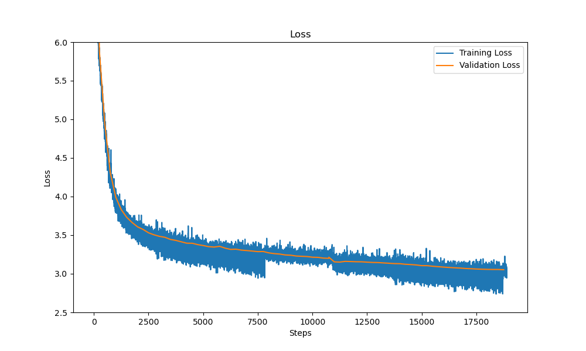

# miniGPT

miniGPT is a PyTorch implementation of GPT-2 (124M parameters) trained from scratch on the FineWebEdu dataset. This implementation follows optimization techniques from the GPT-3 paper and includes various performance improvements for efficient training.


## Model Performance Highlight 🚀
| Metric   | **miniGPT** | GPT-2 124M |
|----------|---------------|----------------|
| HellaSwag Accuracy | **30.42%** 🎯 | 29.55% |


Achieved a accuracy boost over the original GPT-2 on HellaSwag!

## Loss Curve 📉



## Model Architecture 

- GPT-2 base model (124M parameters)
- Implementation based on the original architecture with performance optimizations
- Training aligned with GPT-3 paper hyperparameters

## Features 

- **Performance Optimizations**:
  - Flash Attention implementation
  - Mixed precision training (bfloat16)
  - Gradient accumulation
  - Distributed training support (DDP)
  - Torch.compile optimization
  - Fused AdamW optimizer
  
- **Training Features**:
  - Cosine learning rate decay
  - Weight decay (L2 regularization)
  - Gradient clipping
  - Model checkpointing every 5000 steps
  - Hellaswag evaluation

## Training Details 📊

- **Dataset**: FineWebEdu (10B tokens sample)
- **Training Duration**: 1 epoch, 19073 steps
- **Hardware**: 6x NVIDIA A100 (40GB VRAM each)
- **Training Time**: ~3 hours 45 minutes
- **Training Cost**: ~$30 
- **Performance**:
  - Initial validation loss: 10.95
  - Final validation loss: 3.05
  - Hellaswag accuracy: 30.42% (surpassing original GPT-2's 29.55%)

## Performance Improvements 📈

Step-by-step improvements achieved during development:
1. Base implementation: 1100ms/step
2. TF32 optimization: 400ms/step
3. bfloat16 conversion: 340ms/step
4. torch.compile: 150ms/step
5. Flash Attention: 107ms/step
6. Vocab size optimization: 100ms/step

## Installation 🛠️

```bash
# Clone the repository
git clone [repo-url]
cd [repo-name]

# Install requirements
pip install -r requirements.txt
```

## Usage 💻

### Training

```bash
# For single GPU
python train.py

# For distributed training
torchrun --nproc_per_node=6 train.py
```

### Inference

```python
from predict import GPTPredict
import torch

model = GPTPredict('path/to/checkpoint')
input = 'I am a language model'
response = model.generate(input)
```

## Acknowledgments 🙏

- Based on Andrej Karpathy's video [ Let's reproduce GPT-2 (124M)](https://www.youtube.com/watch?v=l8pRSuU81PU)
- Training infrastructure used [JarvisLabs.ai](https://jarvislabs.ai/)
